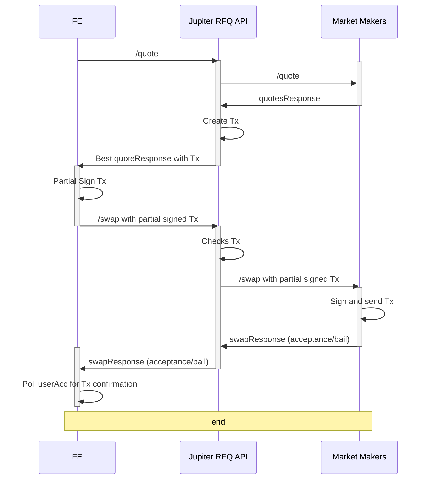

# RFQ Webhook Toolkit

:mega: NOTE: This section is still heavily subjected to changes, and we are open to suggestions or feedbacks on ways to improve and streamline the integration. If you are interested in being a MM on Jupiter RFQ, please read the below toolkit and reach out to [Soju](https://t.me/sojuuuu54) / [Ben](https://t.me/benliewxyz) on Telegram to register your webhook.


## Order Engine

The RFQ functionality depends on the mainnet deployment of the [Order Engine Program](https://solscan.io/account/61DFfeTKM7trxYcPQCM78bJ794ddZprZpAwAnLiwTpYH) for order fulfillment.

- **Source Code**: The program's source is located in the [`programs/order-engine`](./programs/order-engine) directory.
- **IDL**: The Interface Definition Language (IDL) file is available [here](./idls).

## Audit

- [Offside labs audit report](audits/Jupiter-RFQ-Nov-2024-OffsideLabs.pdf): Offside labs has audited the order engine program [`programs/order-engine`](programs/order-engine) and the off-chain validation [`order-engine-sdk/src/fill.rs`](order-engine-sdk/src/fill.rs)

## Market Maker Integration Guidelines

The following diagram gives an overview of the request workflow:





## Integration specifications

To facilitate the integration into Jupiter's RFQ module, you will need to provide a webhook for us to register the quotation and swap endpoints with the corresponding request and response format.

### Example URL that we will register into our api

```
https://your-api-endpoint.com/jupiter/rfq
```

Endpoints we will call after registration

```
POST https://your-api-endpoint.com/jupiter/rfq/quote
POST https://your-api-endpoint.com/jupiter/rfq/swap
```

In addition, the webhook will be called at regular intervals to fetch the list of supported tokens (see [below](#advertising-supported-tokens)):

```
GET https://your-api-endpoint.com/jupiter/rfq/tokens
```

#### API Key

If you require an API key to access your endpoints, please provide it to us during the registration process. The API Key will be passed to the webhook as a header `X-API-KEY`.

## Api Documentation

REST API  documentation is provided in OpenAPI format. You can find the documentation [here](./openapi).

A sample server with the API documentation is provider in the [`server-example`](./server-example/) directory. To launch the server, run the following commands (requires rust and cargo to be installed):

```bash
make run-server-example
```

and open the following URL in your browser: [http://localhost:8080/swagger-ui/](http://localhost:8080/swagger-ui/)

### Webhook HTTP reponse codes

Market Makers should return appropriate HTTP status codes along with error messages. The following status codes are supported:

##### Successful responses
- `2oo OK`: The request was successful, and the webhook will return a quote.
- `404 Not Found`: The webhook will not return a quote for this request (e.g. the pair or the size are not supported)

##### Error responses

- `400 Bad Request`: The request sent to the webhook is malformed (e.g. missing an expected parameter) 
- `401 Unauthorized`:  Authorization failed. For example the `X-API-KEY` is missing or incorrect
- `50x Server Errors`: The webhook is offline or unable to respond. If the status perstist, the webhook will be temporarily sospended and will not receive requests.

## Expiry information

We enforce a fixed expiry timing flow for all quotes and transactions:

1. When creating a quote, we set transaction expiry to **55 seconds** from creation time
2. On the frontend:
   - If remaining time before expiry is less than **40 seconds** when user needs to sign, we will automatically requote
   - The frontend will also do a requote every **15s**
3. On the backend:
   - If remaining time before expiry is less than **25 seconds** when our /swap endpoint receives the request, we will reject the swap before forwarding to market makers

This fixed expiry flow simplifies the integration by:

- Removing the need for market makers to specify custom expiry times in quote requests
- Providing consistent behavior across all quotes and transactions
- Allowing for clear timeout boundaries at different stages of the flow

Note: These expiry thresholds may be adjusted based on performance and feedback.


## Advertising supported tokens

In order to receive relevant quote requests, market makers need to advertise the tokens they support. This is done by providing a list of supported tokens in the response to the `/tokens` route. The response should be a JSON array of token addresses. The list of tokens is refreshed every 10 minutes.


## Technical integration

To facilitate the integration, in this repository you will find a sample server that implements the webhook API. The server is written in Rust and can be found in the [`server-example`](./server-example/) directory.

In addition, we provide a set of test suites to verify the implementation of the webhook. The tests, and their instructions, can be found in the [`tests`](./tests/) directory.

## Fees

Jupiter RFQ allows MMs a way to provide liquidity, adjust their quotes without being subject to the volatility of on-chain gas prices or chain health. RFQ fills are also much less CU intensive (<10x) compared to AMM swaps, and can save gas in the long run on fills. Today, RFQ charges a dynamic fee that is selected based on factors like tokens and size. The dynamic fee amount is forwarded to webhooks in the quote request parameters and it is appended to the message data (2 additional bytes, u16). Note that thae fee is not part of the message itself, it is only appended as additional bytes.

ℹ️ Webhooks do not need to account for fees when quoting; the fee is applied directly by the RFQ system during transaction building. For example, for a quote of 1 SOL to 1000 USDC with a fee of 100 bps, only 990 USDC will be transferred out of the market maker account, while 10 USDC will be collected as a fee. Note that the fee is not automatically transferred and will be accounted for asyncronously on a regular basis.

## Future considerations/plans


#### Fulfillment Requirements

Market makers are expected to comply with 90% of the quotation swap requests provided before getting penalized.

#### Transaction Crafting

Current implementation enforces that Jupiter RFQ API will be the one crafting the instructions and transactions, however in the future we are working to improve on the flow to allow market makers to have the flexibility to craft their own transactions with a set of whitelisted instructions.

#### Transaction sending

Some market makers may not wish to be the ones handling the sending of transactions on chain. We may look into helping market makers land their transactions on chain in the future.


## FAQ

##### Does RFQ support native SOL?

Yes, native SOL is fully supported in the order-engine program for both the taker (user) and the maker. However, for now, we assume the maker will use WSOL (Wrapped SOL).

##### Do faster quotes receive priority?

No, the RFQ system dispatches the quote request to all registered webhooks simultaneously with a 500ms timeout. During this time, all received quotes are compared to select the best one. The selection prioritizes the quote value first. If two quotes have identical values, the quote from the webhook with the faster response time will be chosen.

##### Shall a webhook verify swap requests?

Yes, the RFQ system will verify the swap requests before forwarding them to the webhooks. However, webhooks are encouraged to verify the swap requests as well to ensure the integrity of the system. The checks that the RFQ system performs can be found in the [validate_similar_fill_sanitized_message](https://github.com/jup-ag/rfq-webhook-toolkit/blob/de46a38c3cfbda730c026a9b4bea85591c83f9e5/order-engine-sdk/src/fill.rs#L151) function.
