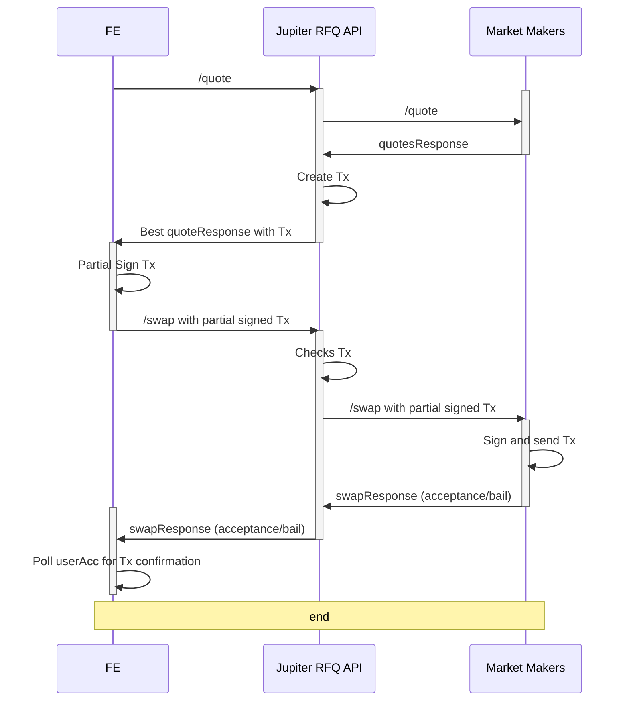

# RFQ Webhook Toolkit

:mega: NOTE: This section is still heavily subjected to changes, and we are open to suggestions or feedbacks on ways to improve and streamline the integration. If you are interested in being a MM on Jupiter RFQ, please read the below toolkit and reach out to [Soju](https://t.me/sojuuuu54) / [Ben](https://t.me/benliewxyz) on Telegram to register your webhook.


## Order Engine

The RFQ functionality depends on the mainnet deployment of the [Order Engine Program](https://solscan.io/account/61DFfeTKM7trxYcPQCM78bJ794ddZprZpAwAnLiwTpYH) for order fulfillment.

- **Source Code**: The program's source is located in the [`programs/order-engine`](./programs/order-engine) directory.
- **IDL**: The Interface Definition Language (IDL) file is available [here](./idls).

## Audit

- [Offside labs audit report](audits/Jupiter-RFQ-Nov-2024-OffsideLabs.pdf): Offside labs has audited the order engine program [`programs/order-engine`](programs/order-engine) and the off-chain validation [`order-engine-sdk/src/fill.rs`](order-engine-sdk/src/fill.rs)

## Market Maker Integration Guidelines

The following diagram gives an overview of the request workflow:





## Integration specifications

To facilitate the integration into Jupiter's RFQ module, you will need to provide a webhook for us to register the quotation and swap endpoints with the corresponding request and response format.

### Example URL that we will register into our api

```
https://your-api-endpoint.com/jupiter/rfq
```

Endpoints we will call after registration

```
POST https://your-api-endpoint.com/jupiter/rfq/quote
POST https://your-api-endpoint.com/jupiter/rfq/swap
```

In addition, the webhook will be called at regular intervals to fetch the list of supported tokens (see [below](#advertising-supported-tokens)):

```
GET https://your-api-endpoint.com/jupiter/rfq/tokens
```

#### API Key

If you require an API key to access your endpoints, please provide it to us during the registration process. The API Key will be passed to the webhook as a header `X-API-KEY`.

## Api Documentation

REST API  documentation is provided in OpenAPI format. You can find the documentation [here](./openapi).

A sample server with the API documentation is provider in the [`server-example`](./server-example/) directory. To launch the server, run the following commands (requires rust and cargo to be installed):

```bash
make run-server-example
```

and open the following URL in your browser: [http://localhost:8080/swagger-ui/](http://localhost:8080/swagger-ui/)

### Webhook Error Responses

Market Makers should return appropriate HTTP status codes along with error messages. The following status codes are supported:

### Severe errors

- `400 Bad Request`: When the request parameters sent by Jupiter are invalid or malformed
- `401 Unauthorized`: When authentication fails, e.g x-api-key is not provided or invalid

### Warnings

- `404 Not Found`: When the requested resource doesn't exist, as in case of a token not being supported

### Service errors

This is when the market maker is unable to fulfill the request due to internal issues. Jupiter may stop sending requests to the market maker if this happens too frequently.

- `500 Internal Server Error`: When an unexpected error occurs on the market maker's side
- `503 Service Unavailable`: When the market maker service is temporarily unavailable

## Acceptance tests

We have provided a set of acceptance tests that you can run to verify that your implementation is correct. The tests can be found in the [`acceptance`](./tests/suites/acceptance/) directory.

To run the tests, you will need to have a recent nodejs version, pnpm and vitest installed. To run the tests, after installing the dependencies, run the following command:

```bash
make prepare-acceptance-tests
```

and then run the tests with:

```bash
WEBHOOK_URL=<your_webhook_url> make run-acceptance-tests
```

for an example, you can run the tests against the sample server:

```bash
make run-acceptance-tests-against-sample-server
```


## Expiry information

We enforce a fixed expiry timing flow for all quotes and transactions:

1. When creating a quote, we set transaction expiry to **55 seconds** from creation time
2. On the frontend:
   - If remaining time before expiry is less than **40 seconds** when user needs to sign, we will automatically requote
   - The frontend will also do a requote every **15s**
3. On the backend:
   - If remaining time before expiry is less than **25 seconds** when our /swap endpoint receives the request, we will reject the swap before forwarding to market makers

This fixed expiry flow simplifies the integration by:

- Removing the need for market makers to specify custom expiry times in quote requests
- Providing consistent behavior across all quotes and transactions
- Allowing for clear timeout boundaries at different stages of the flow

Note: These expiry thresholds may be adjusted based on performance and feedback.


## Advertising supported tokens

In order to receive meaningful quote requests, market makers need to advertise the tokens they support. This is done by providing a list of supported tokens in the response to the `/tokens` endpoint. The response should be a JSON array of token addresses, to add or remove to the list of supported tokens for the webhook.

The following list of tokens will always be included in the request:

1. USDC/WSOL `EPjFWdd5AufqSSqeM2qN1xzybapC8G4wEGGkZwyTDt1v`/`So11111111111111111111111111111111111111112`

## Future considerations/plans


#### Fulfillment Requirements

Market makers are expected to comply with 90% of the quotation swap requests provided before getting penalized.

#### Transaction Crafting

Current implementation enforces that Jupiter RFQ API will be the one crafting the instructions and transactions, however in the future we are working to improve on the flow to allow market makers to have the flexibility to craft their own transactions with a set of whitelisted instructions.

#### Transaction sending

Some market makers may not wish to be the ones handling the sending of transactions on chain. We may look into helping market makers land their transactions on chain in the future.

### Fees

We will likely introduce a fee in the range bps applied to the MM, based on total filled volume. More details to be announced on the introduction of fees on Jupiter RFQ. Currently, we welcome all MMs to integrate Jupiter RFQ with 0 fees for a limited, testing period.
